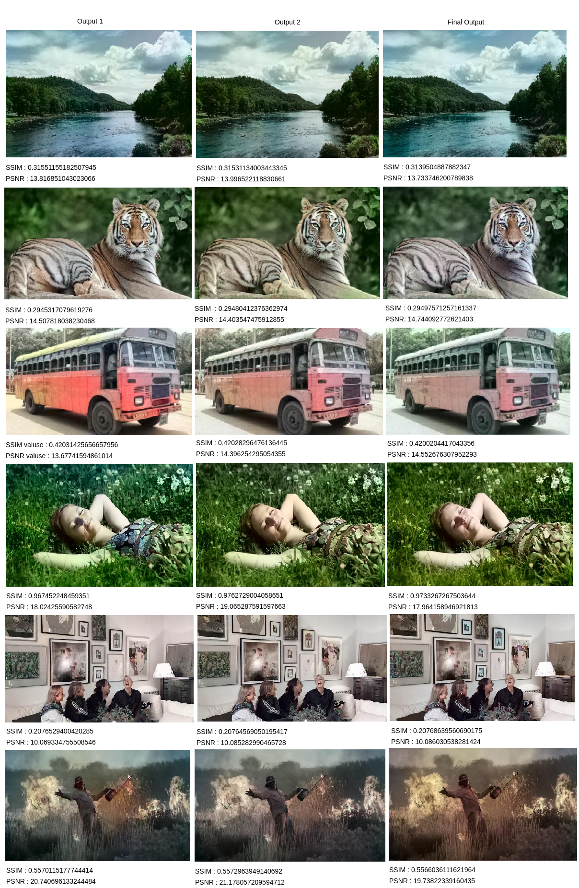
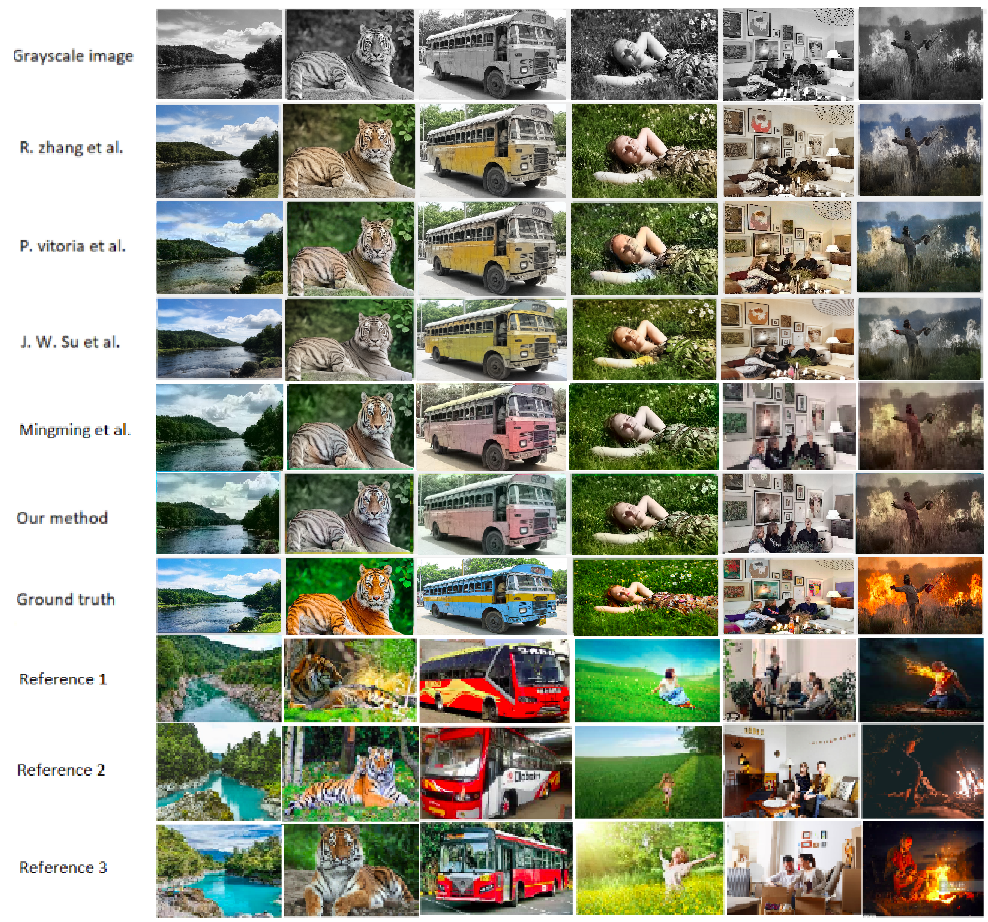

# Deep Exemplar-based Deep Colorization (Pytorch Implementation)



[Pretrained Model](https://facevc.blob.core.windows.net/zhanbo/old_photo/colorization_checkpoint.zip) 


[Jitendra Chautharia](IIT Jodhpur)<sup>1,3</sup>,


## Prerequisites

- Python 3.6+
- Nvidia GPU + CUDA, CuDNN

## Installation

First use the following commands to prepare the environment:

```bash
conda create -n ColorVid python=3.6
source activate ColorVid
pip install -r requirements.txt
```

Then, download the pretrained models from [this link](https://facevc.blob.core.windows.net/zhanbo/old_photo/colorization_checkpoint.zip), unzip the file and place the files into the corresponding folders:

- `video_moredata_l1` under the `checkpoints` folder
- `vgg19_conv.pth` and `vgg19_gray.pth` under the `data` folder

## Data Preparation

In order to colorize your own video, it requires to extract the video frames, and provide a reference image as an example.

- Place your Target grayscale image into one folder, _e.g._, `./exp_sample/target`
- Place your reference images into another folder, _e.g._, `./exp_sample/references`

If you want to _automatically_ retrieve color images, you can try the retrieval algorithm from [this link](https://github.com/hmmlillian/Gray-Image-Retrieval) which will retrieve similar images from the ImageNet dataset. Or you can try [this link](https://github.com/pochih/CBIR) on your own image database.

## Test

```bash
python test.py --image-size [image-size] \
               --clip_path [path-to-target-grayscale-image] \
               --ref_path [path-to-reference] \
               --output_path [path-to-output]
```

We provide several sample video clips with corresponding references. For example, one can colorize one sample legacy video using:

```bash
python test.py --clip_path ./exp_sample/target \
               --ref_path ./exp_sample/references \
               --output_path ./exp_sample/output
```

Note that we use 216\*384 images for training, which has aspect ratio of 1:2. During inference, we scale the input to this size and then rescale the output back to the original size.

## Train

We also provide training code for reference. The training can be started by running:

```bash
python --data_root [root of video samples] \
       --data_root_imagenet [root of image samples] \
       --gpu_ids [gpu ids] \
```

We do not provide the full video dataset due to the copyright issue. For image samples, we retrieve semantically similar images from ImageNet using [this repository](https://github.com/hmmlillian/Gray-Image-Retrieval). Still, one can refer to our code to understand the detailed procedure of augmenting the image dataset to mimic the video frames.

## Comparison with State-of-the-Arts

<figure>

</figure>


```
